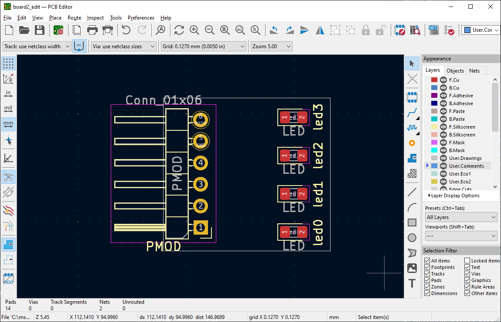
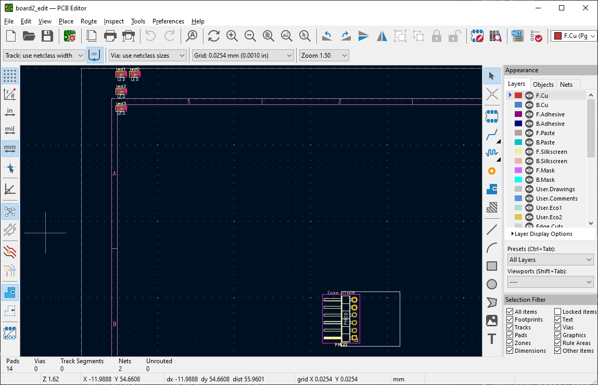
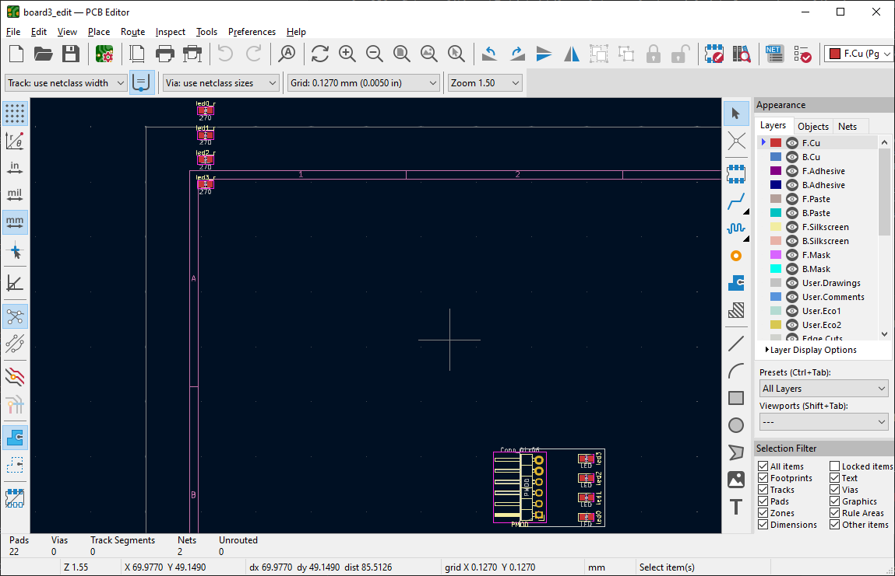
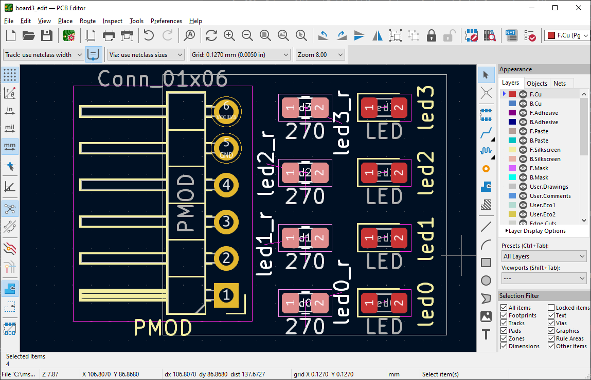
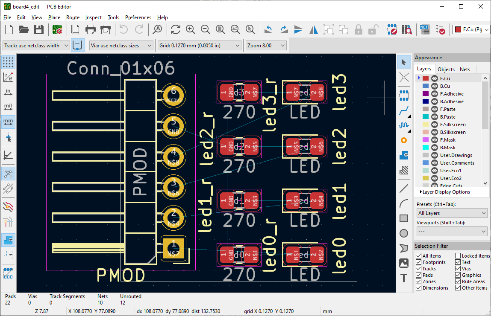
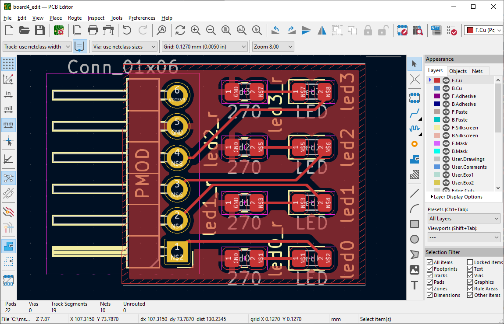

# skidl-tools

## TL;DR

This tool helps doing iterative design between a PCB described in [skidl](https://devbisme.github.io/skidl/)
(python code) and [KiCad](https://www.kicad.org/)'s PCB editor (PcbNew): start placing and routing, go
back to code and add components, resume editing without loosing your previous changes.

**This is very much work in progress**, please see [Limitations](#limitations).

## What is in this repo?

A collection of tools (one for now!) to help with PCB design using [KiCad](https://www.kicad.org/)
and [skidl](https://devbisme.github.io/skidl/).

The main tool is `skidl-updater`, it takes a previous design and a newly generated
PCB from skidl, and remaps prior edits onto the new file. See [Example workflow](#example-workflow) below.

## How to compile

```
git submodule init
git submodule update
mkdir BUILD
cd BUILD
cmake ../updater/
make install
```

## Example workflow

This tutorial example walks through the process of progressively adding components to a board, using `skidl-updater` at each step to import prior changes to the PCB. For the sake of the tutorial the example is voluntarily cut
into many small incremental steps.

> Note: the tutorial assumes some familiarity with KiCad's layout editor (PcbNew).

> This tutorial uses KiCad 7.

The goal is to design a simple 'half-PMOD' (using only one PMOD row)
with four LEDs on it. All files are in [`examples/pmod_leds`](examples/pmod_leds).
Here is the workflow:
- We start by a simple script defining VCC and GND nets and adding a connector, [board1.py](examples/pmod_leds/board1.py). Note how the connector is using a `ref` attribute (`PMOD`), this is essential to the inner workings of `skidl-updater`: each component has to have a unique `ref`.
To generate the board we run `python board1.py`.

> Note: the script has to be run from a special python environment provided by KiCad, please refer to skidl's documentation.

- We open the generated [board1.kicad_pcb](examples/pmod_leds/board1.kicad_pcb), create a board contour and place the connector, save the board and exit.



- Now, we add the LEDs in [board2.py](examples/pmod_leds/board2.py). We generate [board2.kicad_pcb](examples/pmod_leds/board2.kicad_pcb) by running `python board2.py`.
However `board2.kicad_pcb` has lost the contour and placement of the connector  we did at step one. We don't want to redo what we just did, so we use `skidl-updater`:

`skidl-updater -p board1.kicad_pcb -n board2.kicad_pcb -o board2_edit.kicad_pcb`

- This command takes the content of `board1.kicad_pcb` as reference and imports it into `board2.kicad_pcb` to obtain `board2_edit.kicad_pcb`. We now can open `board2_edit.kicad_pcb` and are ready to place the LEDs, prior edits have been imported! We now place the LEDs neatly on the board, save and exit.




- We also need a resistor per LED, so we add them to obtain [board3.py](examples/pmod_leds/board3.py) and
run  `python board3.py` to obtain `board3.kicad_pcb`, which has again lost all our edits. `skidl-updater` to the rescue!

`skidl-updater -p board2_edit.kicad_pcb -n board3.kicad_pcb -o board3_edit.kicad_pcb`




- Final step, we need to connect everything together. Each LED will be lit by one of the four signals from the half-PMOD. We add the connections to obtain [board4.py](examples/pmod_leds/board4.py) and generate the PCB with
`python board4.py`. Again all changes are lost, and we use `skidl-updater` to save the day:

`skidl-updater -p board3_edit.kicad_pcb -n board4.kicad_pcb -o board4_edit.kicad_pcb`




The board is done! (maybe don't fab it, it's just a quick example ;) ).

> Note: In the example we save each step, but of course you can start from the
> same file, running `skidl-updater -p board_edit.kicad_pcb -n board.kicad_pcb -o board_edit.kicad_pcb`
> works (it will rename the previous file as a `.bak`, in case something goes wrong).

## Limitations

**There are potential 'gotchas', be worried if kicad reports a warning when opening
the PCB file.**

**Use at your own risks -- always double check your design and the nets.**

Some known issues and workarounds:

- **Removing a component**. The tool is geared towards the idea of progressively
*adding* components to the board. When removing a component, that is the script
no longer produce a component of a given `ref`, then edit the previous version
 `.kicad_pcb` and also delete the component from the board. Otherwise, the
 updater will keep bringing it back, introducing various problems with nets.

- **Swapping the footprint of a component**. As with *Removing a component*,
make sure to edit the previous version `.kicad_pcb` and delete the component
first. You will have to place the new footprint again, but that guarantees the
footprint is properly updated.

> Found another limitation? Please fill-in an issue in github.